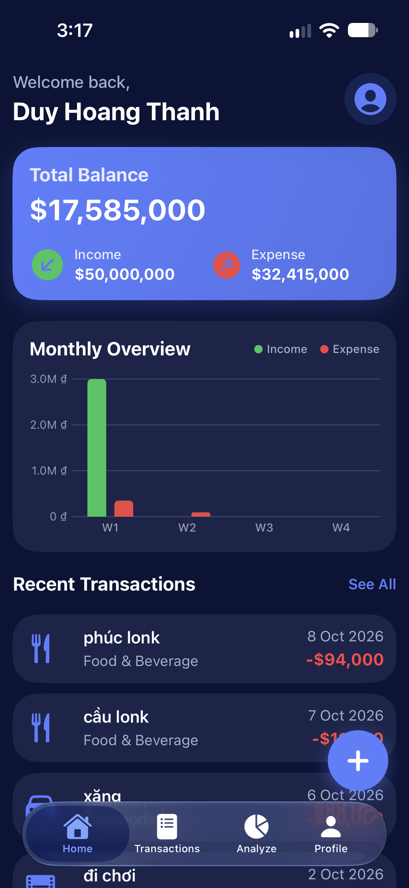
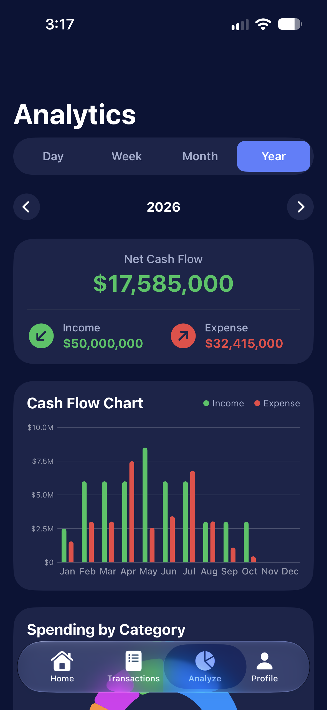
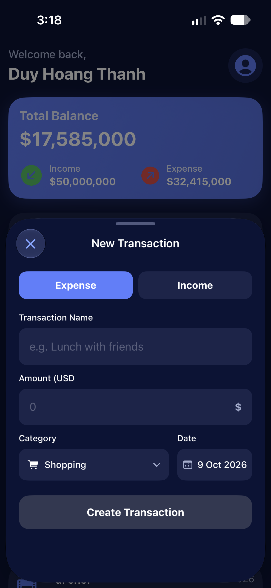
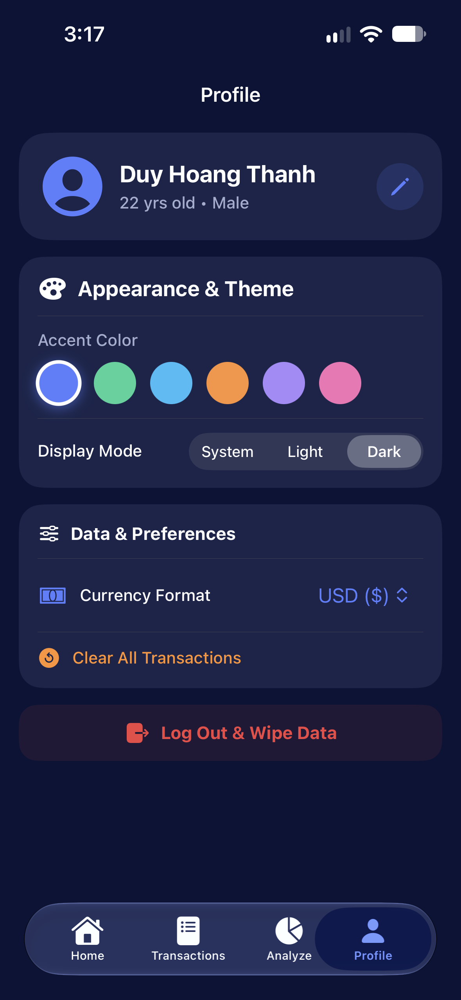

# 💸 RandumApp - Smart Personal Finance Tracker

<p align="center">
  
  
  
  
</p>

<p align="center">
  A sleek, performance-driven personal expense tracker built with pure <b>SwiftUI</b> and <b>Swift Charts</b>. Focused on instant reactive UI updates, dynamic theming, and a polished user experience.
</p>

---

## 🌟 Key Highlights

- **⚡ Reactive App-Wide Theming Engine**: Switch between 6 curated accent palettes (`Indigo`, `Emerald`, `Ocean Blue`, `Sunset Orange`, `Purple`, `Rose Pink`) and `Light/Dark Mode` instantly across the entire navigation stack with smooth transitions.
- **💱 Dynamic Multi-Currency Formatting**: Seamlessly toggle between `VND (₫)` and `USD ($)`. All account balances, summary cards, and chart axes re-format on the fly using centralized formatting logic.
- **📊 Interactive Cash Flow & Category Analytics**:
  - Multi-scope cash flow tracking (`Day`, `Week`, `Month`, `Year`) powered by **Swift Charts**.
  - Interactive Donut chart displaying real-time expense category breakdowns with percentage allocation bars.
- **🛡️ Bulletproof UX & Input Validation**:
  - **Debounced Input Validation** (300ms) for responsive error feedback without main-thread stuttering.
  - Interactive keyboard dismissal (`.scrollDismissesKeyboard(.interactively)`) and seamless avoidance.
  - Safe **Danger Zone** with mandatory typing verification (`"LOGOUT"` / `"CLEAR"`) to prevent accidental data loss.
- **📤 CSV Export**: Built-in export engine allowing users to share comprehensive transaction history via the native iOS share sheet.

---

## 🏗️ Architecture & Tech Stack

- **Frameworks**: SwiftUI, Swift Charts, Combine
- **Architecture**: **MVVM (Model - View - ViewModel)** with a unidirectional state flow:
  - `UserManager` (`ObservableObject`): Handles session lifecycle, user profile state, and avatar synchronization across views.
  - `ThemeManager` (`ObservableObject`): Acts as the Single Source of Truth for accent colors, appearance modes, and currency preferences.
  - `TransactionsViewModel` & `AnalyzeViewModel`: Encapsulates transaction operations, date math, periodic filtering, and chart data transformation.
- **Persistence**: `UserDefaults` with robust `Codable` wrappers.
- **Design System**: Modular, reusable component library (`AppColors`, `AuthTextField`, `AppButton`, Capsule Picker Menus).

---

## 📸 Screenshots

| Home Dashboard | Visual Analytics | Quick Entry Form | Settings & Theme |
|:---:|:---:|:---:|:---:|
|  |  |  |  |

---

## 🚀 Getting Started

1. **Clone the repository**:
   ```bash
   git clone https://github.com/duydev245/random-ios-app.git
   cd RandumApp
```

2. **Requirements:**
- Xcode 15.0+
- iOS 17.0+ (Simulator or Physical Device)

3. **Build & Run:**
- Open RandumApp.xcodeproj in Xcode.
- Select your target device and press Cmd + R.

---
## 👨‍💻Author
**Duy Hoang Thanh (dannyduy)**
- GitHub: @duydev245

